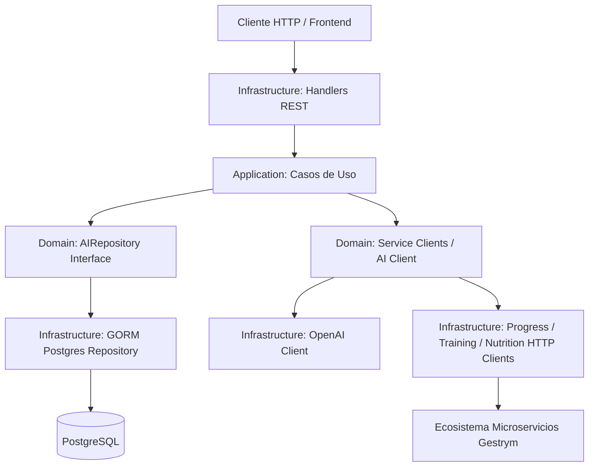

# 🤖 Gestrym AI Service (`gestrym-ai`)

Servicio de Inteligencia Artificial para la plataforma **Gestrym**, encargado de orquestar, generar y adaptar planes personalizados de entrenamiento y nutrición utilizando el motor de **OpenAI** y comunicación RESTful con el ecosistema de microservicios.

---

## 📌 Tabla de Contenidos
- [Descripción General](#-descripción-general)
- [Arquitectura](#-arquitectura)
- [Algoritmo "Smart Coach" e Integración IA](#-algoritmo-smart-coach-e-integración-ia)
- [Estructura del Proyecto](#-estructura-del-proyecto)
- [Endpoints de la API](#-endpoints-de-la-api)
- [Modelo de Datos](#-modelo-de-datos)
- [Integración con Microservicios](#-integración-con-microservicios)
- [Variables de Entorno y Configuración](#-variables-de-entorno-y-configuración)
- [Instalación y Ejecución](#-instalación-y-ejecución)
- [Documentación con Swagger](#-documentación-con-swagger)

---

## 🚀 Descripción General

El **Gestrym AI Service** actúa como el "cerebro" inteligente de Gestrym. Su función principal es recolectar el historial y métricas del usuario desde el `progress-service`, procesar dicha información mediante modelos de lenguaje (LLM) con ingeniería de prompts enfocada en ciencias del deporte y nutrición, y finalmente enviar los planes generados a los microservicios de destino (`training-service` y `nutrition-service`).

### Funcionalidades Clave
- **Generación de Planes de Entrenamiento:** Rutinas personalizadas con manejo de volumen, selección de ejercicios y sobrecarga progresiva.
- **Generación de Planes Nutricionales:** Cálculo de TDEE, distribución de macronutrientes y planes de alimentación ajustados a metas específicas.
- **Adaptación Dinámica por Estancamiento:** Reajuste automático de calorías o volumen de entrenamiento ante plateau de peso o fuerza.
- **Persistencia de Recomendaciones:** Registro detallado de entradas, salidas e historial de sugerencias generadas.

---

## 🏗 Arquitectura

El proyecto sigue los principios de la **Arquitectura Hexagonal (Puertos y Adaptadores)** y **Clean Architecture**, garantizando alta modularidad, desacoplamiento de dependencias y facilidad para pruebas unitarias.



### Capas del Proyecto:
- **`domain`**: Contiene las interfaces de repositorios, definiciones de clientes y modelos del dominio.
- **`application`**: Casos de uso de negocio (`GenerateTrainingPlan`, `GenerateMealPlan`, `AdaptTrainingPlan`, `AdaptMealPlan`).
- **`infrastructure`**: Implementaciones concretas de base de datos (GORM), clientes HTTP externos, integración con OpenAI API y handlers de Gin.
- **`common`**: Middlewares (JWT, API Key), configuración global, sistema de rutas, utilidades y modelos compartidos.

---

## 🧠 Algoritmo "Smart Coach" e Integración IA

### 1. Arquitectura Basada en Proveedores
Se diseñó la interfaz `AIClient`, permitiendo intercambiar o extender la integración con OpenAI (`sashabaranov/go-openai`) hacia otros proveedores LLM sin afectar la lógica del negocio.

### 2. Prompt Engineering Especializado
Cada caso de uso cuenta con prompts de sistema estructurados:
- **Nutrición:** Enfoque en gasto energético diario (TDEE), balance calórico, distribución óptima de macronutrientes y tips profesionales de adherencia.
- **Entrenamiento:** Enfoque en sobrecarga progresiva, volumen semanal por grupo muscular, selección adecuada de ejercicios y rango de repeticiones.

### 3. Flujo de Datos Estructurado y JSON Mode
1. **Recolección:** Se extrae el contexto del usuario (peso, métricas físicas, historial) desde `progress-service`.
2. **Procesamiento:** Invocación a OpenAI habilitando `JSON Mode` para asegurar respuestas estructuradas y parseables.
3. **Orquestación:** El resultado en JSON se parsea y se envía vía HTTP al microservicio correspondiente (`training-service` o `nutrition-service`).

### 4. Lógica de Adaptación Inteligente
- **Estancamiento de Peso (Weight Plateau):** Si el peso se mantiene estancado por X semanas, el sistema ajusta automáticamente el déficit o superávit calórico.
- **Estancamiento de Fuerza (Strength Plateau):** Si las marcas del usuario se detienen, la IA sugiere semanas de descarga (*deload*) o variaciones en volumen e intensidad.

---

## 📂 Estructura del Proyecto

```text
gestrym.AI.Back/
├── IA_MEMORY.md
├── README.md
├── main.go
├── go.mod
├── go.sum
├── docs/                      # Documentación autogenerada de Swagger
└── src/
    ├── app.go                 # Inicialización y arranque del servidor
    ├── ai_service/
    │   ├── application/
    │   │   └── usecases/      # Generación y Adaptación de planes (Training & Nutrition)
    │   ├── domain/
    │   │   ├── clients/       # Interfaces de clientes externos
    │   │   └── repositories/  # Interfaces de repositorios del dominio
    │   └── infrastructure/
    │       ├── clients/       # Clientes HTTP (OpenAI, Progress, Training, Nutrition)
    │       ├── dtos/          # Data Transfer Objects
    │       ├── handlers/      # Controladores HTTP Gin (AIHandler)
    │       └── repositories/  # Implementación de repositorios con GORM
    └── common/
        ├── config/            # Conexión Postgres y Migraciones GORM
        ├── middleware/        # JWT Authentication & API Key Middlewares
        ├── models/            # Modelos GORM (AIRecommendation)
        ├── routes/            # Configuración de Router Gin & CORS
        ├── shared/            # Estructuras compartidas
        └── utils/             # Logger y helpers
```

---

## 🔗 Endpoints de la API

Todos los endpoints base están bajo el prefijo `/gestrym-ai`.

### Rutas Privadas (Requiere Middleware JWT Bearer)

| Método | Endpoint | Descripción |
| :--- | :--- | :--- |
| `POST` | `/gestrym-ai/private/ai/generate-training-plan` | Genera un plan de entrenamiento con IA y lo envía a `training-service`. |
| `POST` | `/gestrym-ai/private/ai/generate-meal-plan` | Genera un plan nutricional con IA y lo envía a `nutrition-service`. |
| `POST` | `/gestrym-ai/private/ai/adapt-training-plan` | Adapta un plan de entrenamiento existente según progreso del usuario. |
| `POST` | `/gestrym-ai/private/ai/adapt-meal-plan` | Adapta un plan nutricional según estancamiento o evolución física. |
| `GET`  | `/gestrym-ai/private/ai/recommendations/:userId` | Obtiene el historial de recomendaciones de IA de un usuario. |

---

## 🗄 Modelo de Datos

### `AIRecommendation` (Tabla PostgreSQL)
Almacena el contexto de entrada y la respuesta generada por la IA para auditoría e historial.

- `id`: UUID (Primary Key)
- `user_id`: UUID (ID del usuario)
- `type`: String (`TRAINING` | `NUTRITION`)
- `input`: JSON (Contexto recolectado y enviado a la IA)
- `output`: JSON (Plan o recomendación generada por la IA)
- `created_at`: Timestamp
- `updated_at`: Timestamp

---

## 🔄 Integración con Microservicios

Este servicio interactúa mediante REST API con los demás microservicios de la arquitectura Gestrym:

1. **`progress-service`**: Extrae las métricas físicas, histórico de peso y avance del usuario.
2. **`training-service`**: Recibe y guarda las rutinas generadas/adaptadas por la IA.
3. **`nutrition-service`**: Recibe y guarda los planes de alimentación estructurados.

---

## ⚙️ Variables de Entorno y Configuración

El proyecto soporta configuración local vía YAML (`deployment/env_local.yaml`) y configuración en producción (ej. Render) a través de variables de entorno del sistema (gestión automática con `Viper`).

| Variable | Descripción | Ejemplo |
| :--- | :--- | :--- |
| `GESTRYM_AI_SERVER_ADDRESS` | Host y puerto del servidor | `:8084` o `0.0.0.0:8084` |
| `GIN_MODE` | Modo de ejecución de Gin | `debug` / `release` |
| `OPENAI_API_KEY` | Llave de API de OpenAI | `sk-proj-...` |
| `POSTGRES_HOST` | Host de la base de datos PostgreSQL | `localhost` |
| `POSTGRES_PORT` | Puerto de PostgreSQL | `5432` |
| `POSTGRES_USER` | Usuario de la BD | `postgres` |
| `POSTGRES_PASSWORD` | Contraseña de la BD | `secret` |
| `POSTGRES_DB` | Nombre de la base de datos | `gestrym_ai_db` |
| `PROGRESS_SERVICE_URL` | URL base del microservicio de progreso | `http://localhost:8081` |
| `TRAINING_SERVICE_URL` | URL base del microservicio de entrenamiento | `http://localhost:8082` |
| `NUTRITION_SERVICE_URL` | URL base del microservicio de nutrición | `http://localhost:8083` |

---

## 🛠 Instalación y Ejecución

### Prerrequisitos
- **Go** (v1.25.0 o superior)
- **PostgreSQL**
- **OpenAI API Key**

### 1. Clonar el Repositorio
```bash
git clone https://github.com/tu-usuario/gestrym.AI.Back.git
cd gestrym.AI.Back
```

### 2. Instalar Dependencias
```bash
go mod tidy
```

### 3. Ejecutar en Modo Desarrollo (Local)
Asegúrate de contar con el archivo `./deployment/env_local.yaml` configurado correctamente.
```bash
go run main.go --local=true
```

### 4. Ejecutar en Modo Producción
```bash
go run main.go
```

---

## 📚 Documentación con Swagger

La API cuenta con documentación interactiva generada con **Swagger / Swag**.

Una vez en ejecución, la interfaz de Swagger está disponible en:
```text
http://<GESTRYM_AI_SERVER_ADDRESS>/gestrym-ai/swagger/index.html
```

Para actualizar los documentos de Swagger tras modificar comentarios de código:
```bash
swag init
```

---

## 🛠 Tecnologías Utilizadas

- **Lenguaje:** Go (v1.25.0)
- **Framework Web:** Gin Gonic
- **ORM / BD:** GORM & PostgreSQL Driver
- **IA:** `github.com/sashabaranov/go-openai`
- **Configuración:** Viper & AutomaticEnv
- **Autenticación:** JWT (`golang-jwt/jwt/v4`) & API Key Middleware
- **Documentación:** Swagger / `swaggo/gin-swagger`
